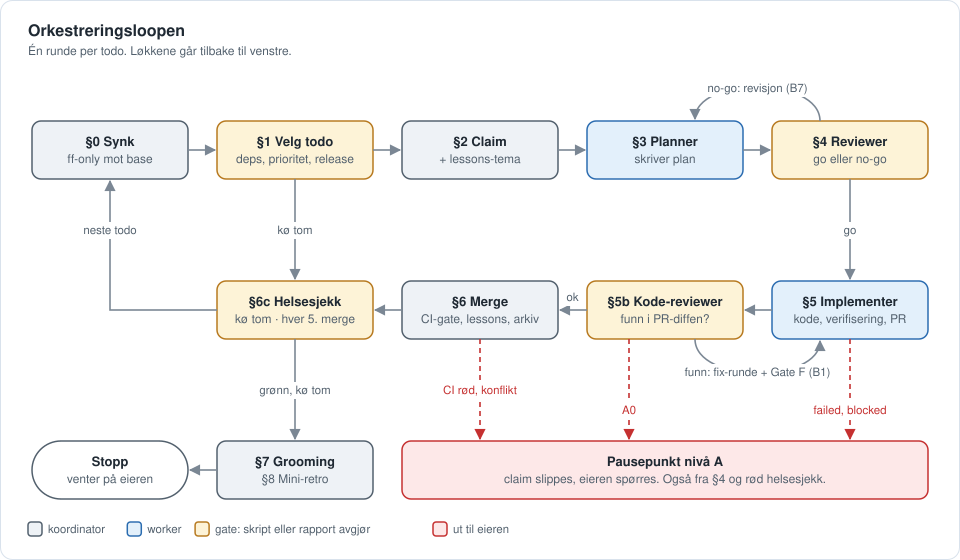
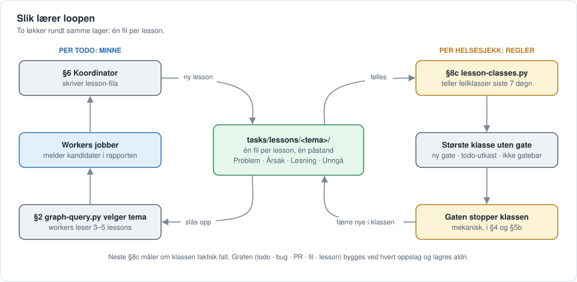

# v3 — agent-orchestrator

Et **parameterisert, selvstendig template** av den autonome orkestreringsloopen: en
koordinator-agent som kjører en kø av todos gjennom planlegging → uavhengig review →
implementering → uavhengig kode-review → merge, uten at du trigger hvert steg. Destillert fra
et live-prosjekt (der loopen har gått i ordinær drift siden juni 2026) og gjort prosjekt-agnostisk via
`loop.config.yaml` + `/setup`.

> Bakgrunn og designresonnement: [`docs/PORTING.md`](docs/PORTING.md). Oppgradering fra v2 eller
> v1: [`MIGRATION.md`](MIGRATION.md).

---

## Slik fungerer loopen

Kitet er en løkke rundt en kø av todo-filer. Én **koordinator** (hovedsesjonen som kjører
`/run-loop`) velger neste todo og sender den gjennom fire kortlevde **workers**, som hver jobber i sin
egen worktree og svarer med en kort rapport. Koordinatoren er den eneste som skriver delt state
(lessons, arkiv, logger) og den eneste som merger.

| Rolle | Agent | Gjør | Skriver |
|---|---|---|---|
| Koordinator | hovedsesjonen | velger todo, dispatcher, gater på rapportene, merger | delt state, base-branchen |
| Planner | `<prosjekt>-planner` | skriver plan med verifiseringsblokk | planfila |
| Reviewer | `<prosjekt>-reviewer` | uavhengig plan-review: `go` eller `no-go` | ingenting (read-only-hook) |
| Implementer | `<prosjekt>-implementer` | koder, verifiserer, åpner PR | feature-branch |
| Kode-reviewer | `<prosjekt>-code-reviewer` | uavhengig review av PR-diffen | ingenting (read-only-hook) |

Boksene er steg i `coordinator-runbook.md`. Gule bokser er gater, der et skript eller en rapport
avgjør neste kant. Røde, stiplede kanter går ut til eieren.



**Løkkene i grafen:**

- **Ytre løkke** (§0 → §6 → §0): én runde per todo, til køen er tom eller et pausepunkt slår inn.
- **Planløkka** (§3 ⇄ §4): `no-go` sender planen tilbake til planneren. Fra runde 2 må gate-funnene
  gå ned, ellers blir det nivå A.
- **Fix-løkka** (§5b → fix-mode → Gate F → §5b): funn går tilbake til implementeren, og Gate F kjører
  planens verifiseringsblokk på nytt før neste review-runde.
- **Helseløkka** (§6c): `/loop-health-check` kjører når køen er tom og etter hver femte merge. Grønn
  sjekk slipper retro-forslagene og tallene videre (§8b, §8c). Rød sjekk stopper loopen.
- **Ikke tegnet:** fast-path (§2b) hopper fra §2 rett til §5 når planen alt er godkjent. §5c og §5d
  kjører planlegging eller implementering av neste todo samtidig med §5.

**Hvem avgjør i gatene:** `tasks/decision-level.py` klassifiserer hvert valg. Nivå B (B1–B7)
avgjør koordinatoren selv, logger i `decision-log.md`, og eieren kan vetoe etterpå. Nivå A (A0–A8)
stopper loopen og spør eieren. A0 er fail-closed: et valg skriptet ikke kan klassifisere, blir aldri
nivå B. Kostnadsbremsen (`tasks/measure-cost.py --brake`) kjøres foran §4- og §5b-gaten.

| Gate i grafen | Avgjøres av |
|---|---|
| §1 kvalifisert todo | `tasks/release.py status` og kø-skriptet i `steps/1-koe-utvelgelse.md` |
| §4 go / no-go | reviewerens `verdict`, `tasks/vblock-lint.py`, `decision-level.py --event plan_review_choice` |
| §5b funn | `review-lens-select.py`, `review-severity-floor.py`, `decision-level.py --event revise_gate_choice` |
| Gate F | `tasks/gate-f.sh` |
| §5d fil-disjunkt | `tasks/parallel-disjoint.py` |
| §6 merge | `tasks/ci-gate.py`, `scripts/check-todo-nr-premerge.sh`, hooken `guard-main-merge.sh` |
| Hver 5. merge | `tasks/loop-cadence.py` |
| §6c helsesjekk | `/loop-health-check` (Del A–D) |

### Selvlærende: atomiske lessons

Loopen lærer av seg selv på to måter. Begge bygger på at en lesson er **atomisk**: én fil per lesson
under `tasks/lessons/<tema>/<dato>-<slug>.md`, med én påstand om kodebasen, plattformen eller
verktøyet. Fila har `**Problem:**`, `**Årsak:**`, `**Løsning:**` og `**Unngå:**`, og frontmatter med
`tags` og `kilder` (`TODO-NN`, `BUG-NNN`). Det finnes ingen indeks og ingen telling som kan bli
utdatert. Filsystemet er indeksen.



- **Rask løkke, per todo (minne):** workers skriver aldri lessons selv. De melder kandidater i
  rapporten, og koordinatoren skriver filene i §6. Før neste todo slår §2 opp i kantgrafen
  (`python3 tasks/graph-query.py --todo <nr>` og `--file <sti>`), som viser hvilke lessons, bugs og
  tidligere todoer som henger sammen med filene todoen rører. Koordinatoren velger 1–3 tema, og
  workeren leser de 3–5 relevante filene, aldri en hel mappe. Atomiske filer er det som gjør dette
  mulig: en lesson kan hentes alene, uten å lese resten av temaet.
- **Treg løkke, per helsesjekk (regler):** §8c teller hvilke feilklasser lessons fra de siste sju
  døgnene faller i. Den høyest rangerte klassen uten mekanisk gate må få ett av tre utfall: ny gate
  nå, todo-utkast, eller «ikke gatebar» med grunn. «Ingenting skjedde» er ikke lov. En feil som
  gjentar seg, går dermed fra å være noe agentene må huske, til å være noe et skript stopper. Neste
  §8c måler om klassen faktisk falt.

Grafen bygges ved hvert oppslag og lagres aldri (`tasks/graph.json` sjekkes ikke inn). Klassene og
gatene i `lesson-classes.py` er eksempler og må tilpasses etter noen runder.
Lessons er én av tre kunnskapsbaser. De to andre er brukerminnet (samarbeidspreferanser) og
agent-minnet (arbeidsmetode per rolle), se `docs/loop-rules.md` § «Tre kunnskapsbaser».

Operatørens utgave av det samme står i `docs/orchestration-loop.md` i det installerte prosjektet.
Hvert steg har sin egen fil under `docs/superpowers/loop/steps/`.

---

## Hva er nytt vs. v2

Kontrollmodellen er den samme som i v2 (koordinator + uavhengige workers, menneske kun ved
pausepunkter). v3 er v2 pluss herding fra drift, og at `/setup` nå installerer
**hele** maskineriet — ikke bare charterne. Det som var bedre i v2-versjonen i dette repoet
(todo-nr-vakt, hotfix-runbook, TDD-orden, konsoliderings- og rivegater) er portet inn og tilpasset
v3-formatene.

**v3.6.1** (køsiden):
- **Vente-grunn i pillen:** en `venter`-rad sier hva den venter på (deps, brainstorm, triage, eier,
  en annen release) i stedet for bare «venter».
- **Plan-status på hver rad** («ingen plan», «plan til godkjenning», «plan godkjent»), også i banene
  for planlagte og leverte releaser. Pillen «plan skrevet» er borte fra HTML-siden.
- **Epic-pille** på radene i planlagte releaser.
- **`epic:`-feltet vinner over `CLUSTERS`** og tags. Før vant nummer-settene. Sett
  `EPIC_FROM_FIELD = False` i `queue-config.py` for å beholde gammel rekkefølge.
- **`REST_EPICS`** (ny, valgfri nøkkel i `queue-config.py`): epic-navn som er restkort og sorteres
  sist sammen med «Uklassifisert».
- **Nivå B-lista og leverte releaser** ligger i `<details>`, lukket som standard.
- **Vakt:** en release som har todoer, men ingen bane på siden (f.eks. `release:` uten release-fil),
  stopper generatoren med feil.

**v3.6** (felles køside):
- **`tasks/queue-status.py` er lik i alle prosjekter:** køsiden (markdown, `--html` med
  release-baner, epics, filtre og datakvalitet, mermaid) er prosjektnøytral. Releaser, mål,
  `done_when`, epics, fremdrift og «levert» kommer fra `tasks/releases/` via `release.py`.
- **`tasks/queue-config.py`** (prosjekt-eid, valgfri) har alt prosjektspesifikt: tittel, eierskap,
  notater, epic-klynger, gamle release-tags, leverte releaser og merknader. Ukjente nøkler stopper
  generatoren.
- **Felles Køsiden-rad i `artifacts.md`** med samme generator og vakter (`--print-title`) overalt.
  `artifacts.md` er seed-only, så URL-ene overlever `/setup`.
- **`tasks/kit-drift.py`** (helsesjekk A5f) melder når et prosjekts `queue-status.py` eller
  Køsiden-rad har gått bort fra malen. Migrering: [`MIGRATION.md`](MIGRATION.md#fra-v35-til-v36).

**v3.5** — tre endringer:
- **Avstemming per todo:** `python3 tasks/decision-level.py --auto-decided <nr>` skriver run-log-tokenet
  `auto_decided=<nr>:<n>`, og `--reconcile` avstemmer hver run-log-rad mot decision-log (helsesjekk D4). Tokenet
  telles aldri for hånd. `--event … --todo <nr> --title <tekst>` gir `header`-feltet, som limes ordrett inn som
  overskrift i decision-log. §6 steg 5: tell først, ta radtiden fra klokka etterpå.
- **§5b leses smalt:** at gate-funnene ikke går ned, eller at en ny feilklasse dukker opp, er nivå B1 i
  §5b. Innholdsfunn, manglende konvergensdata og kostnadsbremsen er fortsatt A0. §4 er uendret.
- **`over=few`:** `measure-cost.py --brake` gir `over=few` når effort-klassen har færre enn 5 andre
  todoer med målt kost. `cost_over=few` gir A0 for en ny fix-runde i §5b fra runde 2, og teller som `no` i §4 og
  i runde 1.
- Sjekk: `python3 tasks/decision-level.py --self-test` (`52/52`, `logg-parser: PASS`, `avstemming: PASS`) og
  `python3 tasks/measure-cost.py --brake-self-test` (`6/6`).

**v3.4.6** — kostnadsmålingen kalibreres mot harnessens eget tall:
- **`python3 tasks/measure-cost.py --calibrate`** skriver én linje per avsluttet økt: harnessens
  `cost-state.totalCostUSD`, egen sum (hovedfil + underagenter i vinduet `startTime`–slutt), avvik og `final`
  (andelen underagent-meldinger med endelig usage). Avvik over 10 % gir `over=yes` og exit 1.
- **KJENT HULL:** fra Claude Code 2.1.281 mangler underagent-transkriptene endelig usage, så egen sum blir for
  lav. Negativt avvik med `final` under 50 % meldes som `KJENT HULL` (exit 0) og etterprøver ikke prisene.
- **`--prices-check <fil>`** sammenligner pristabellen med prissiden (hentes med `curl`, se kommentaren ved `PRICES`).
- **Helsesjekken** har steget A5e, som kjører kalibreringen og aldri gjør helsesjekken rød.
- Sjekk: `python3 tasks/measure-cost.py --calibrate-self-test` (`9/9`).

**v3.4.5** — kalibrert beslutningsgrense (konvergens i stedet for rundetak, kostnadsbrems, samsvarsmåling, veto-flate):
- **Konvergensregel** (`coordinator-runbook.md` § Konvergensregel): fast rundetak er fjernet og
  erstattet av konvergens. Fra runde 2 er en ny plan-/fix-runde nivå B (B7/B1) bare når gate-funnene går ned,
  ingen ny feilklasse dukker opp og funnene bare gjelder form (ikke RLS/datamodell/omfang); ellers A0. `tasks/decision-level.py` har 39 fixtures.
- **Kostnadsbrems:** `python3 tasks/measure-cost.py --brake <nr> [--pr <n>]` gir `over=yes` når todoen koster
  mer enn 2× medianen i samme effort-klasse. `cost_over=yes` gir A0 i alle runder, også runde 1.
- **Samsvarsmåling:** nivå A-entries i `decision-log.md` får `Type:`/`Anbefaling:`/`Eierens svar:`.
  `decision-level.py --agreement` teller fulgt/avvek per type (helsesjekk D5, § Kalibrering).
- **Veto-flate:** `decision-level.py --recent-b` og en «Nivå B siste 24 t»-seksjon øverst i `tasks/queue-status.py`.
- Sjekk: `python3 tasks/decision-level.py --self-test` (`39/39`, `logg-parser: PASS`) og
  `python3 tasks/measure-cost.py --brake-self-test` (`5/5`).

**v3.4.4**:
- **`/todo-new`** oppretter én todo: duplikatsøk først, neste ledige nr fra `tasks/next-todo-nr.sh`
  (todos, arkiv og åpne PR-er på `origin/<base>`; exit 1 når en kilde ikke kan leses), frontmatter
  etter skjemaet og en `docs/`-PR uten claim. Sjekk: `bash tasks/test-next-todo-nr.sh`.
- **`/lesson-new`** skriver én lesson utenfor `/todo-done`: riktig kunnskapsbase (lessons, MEMORY.md
  eller agent-minne), duplikatsøk, filnavn fra `tasks/lesson-path.py` (samme slug som migreringen til
  atomære filer, `-2` ved kollisjon, `--tags` for gjenbruk) og en `docs/`-PR. Sjekk: `--self-test`.

**v3.4.3**:
- **`/handover`** for koordinator-sesjoner. `tasks/handover-state.sh` måler tilstanden (claims, worktrees,
  release, PR-er, decision-log, om hovedsjekkouten ligger bak base). `docs/superpowers/loop/artifacts.md` er
  eneste sted lenkene til de faste artefaktene står. Kommandoen republiserer dem, skriver overleveringsfila og
  lager startprompten. `/endsession` peker til `/handover` i koordinator-sesjoner.
- **`/run-loop`-preflight:** tom `node_modules` er et pausepunkt («kjør `npm ci`»), ikke «E2E: MANGLER».

**v3.4.2**:
- **§5d tillater klientkode.** `--forbid-prefix app/ components/ lib/` er fjernet fra gate P og M,
  sammen med `client-code`-grenen og `gate_m_i`-bindingen. Forutsetningen er en e2e-lås som
  serialiserer kjøringene (port per implementer + `mkdir`-lås i `todo-finish-worker`). Ny regel:
  rører både A og B klientkode, synker B mot base og kjører e2e på nytt etter at A er merget.

**v3.4.1**:
- **§1 tar med `status: reviewed`.** Før var bare `open` kvalifisert, så todoer med godkjent plan
  var usynlige for kø-utvelgelsen. Med en aktiv release ga det `PÅGÅR` og stopp selv om den
  klareste jobben lå i scope. §2 sender en `reviewed`-todo rett til §5 etter ferskhets-gaten i §5c
  (Plan-SHA mot base); tom Plan-SHA eller stale filer gir full §3/§4.

**v3.4** (releaser med mål):
- **Release-filer:** `tasks/releases/<versjon>.md` har `status` (`planned`, `active` eller
  `shipped`), `goal`, `cutoff`, en `## done_when`-sjekkliste (releasens definition of done) og
  epics. Todoer peker på releasen med `release:` og eventuelt `epic:`.
- **Loopen jobber mot målet:** med en aktiv release velger §1 bare todoer i scope. Når scopet er
  tomt, stopper loopen med `MÅL NÅDD` eller `MÅL IKKE NÅDD`, i stedet for å hente annet arbeid.
  Planneren får release-målet i dispatchen.
- **Prod-release-todo per release:** en todo med `tags: [prod-release]`, eid av mennesket. Loopen
  velger den aldri og peker på den når målet er nådd.
- **Scope-vakt:** nye funn får ikke `release:` automatisk. Etter cut-off slipper bare
  `release_blocker: true` inn, og `release.py status` advarer om resten.
- **`tasks/release.py`:** `status` (fremdrift, også per epic, og DOM), `scope` og `notes` (release
  notes fra arkivet). Helsesjekken og køoversikten viser fremdriften, og
  `measure-cost.py --release <versjon>` gir kostnaden per release.
- Uten en aktiv release oppfører loopen seg som før.

**v3.3** (mer fra det samme andre prosjektet):
- **Plan-lint før review:** `tasks/vblock-lint.py` har en hard regel R0 (planen må ha en
  `## Steg`-seksjon med minst ett steg), og §4 kjører linten før reviewer-dispatch. En rød plan går
  tilbake til planneren uten å telle som en review-runde.
- **Kadens-gate for helsesjekken:** `tasks/loop-cadence.py` teller merger siden siste `health`-rad,
  sortert på tidsstempel. §6 kjører den etter hver run-log-rad, og exit 1 utløser §6c.
- **Proporsjonalitet:** planneren får eksisterende løsning, kjerne-anslag og budsjett i
  dispatchen, og plan-rapporten har `planned_diff`. Over ~5× budsjett er et pausepunkt før review.
- **`plan_invalid`:** implementeren kan melde at planen ikke holder. Todoen går tilbake til §3 med
  funnet ordrett. Andre gang på samme todo er et pausepunkt.
- **Mindre endringer:**
  - Kanarien i plan-rapporten oppgir linjenummer (`L<N>: <tekst>`).
  - Bug-oppføringer merker påstander som MÅLT eller HYPOTESE.
  - En ny plan står som «utkast — ikke reviewet» til reviewen har godkjent den.
  - Målescriptet sier fra om at transkripter slettes etter `cleanupPeriodDays` (standard 30 dager).

**v3.2** (fra et andre prosjekt som kjørte v2-loopen):
- **Sjekkpunkt ved komprimering (valgfri, av som standard):** koordinatoren skriver et sjekkpunkt
  ved hver steg-overgang. To hooks legger det tilbake i konteksten etter en auto-komprimering og
  logger om det var ferskt. Slås på med `hooks.compaction_checkpoint`; mål på din runtime først
  (`steps/0c-sjekkpunkt.md`).
- **Ett funn per mekanisme:** et review-funn som nevner flere mekanismer deles i flere funn, og
  fix-runden kvitterer per mekanisme. Ellers kan én rettet mekanisme lukke hele funnet.
- **Arbeidstre-vakt i eksempel-lensene:** lensene leser PR-en med `git show <sha>:<sti>` og endrer
  aldri HEAD, indeks eller refs i kode-reviewerens arbeidstre.

**v3.1**:
- **Lessons:** én fil per lesson, `tasks/lessons/<tema>/<dato>-<slug>.md` med `tags`/`kilder`.
  Oppfølginger ligger i `tasks/followups/`. `scripts/split-lessons.py` migrerer gamle temafiler.
- **Runbook:** delt i en kjerne-sjekkliste, én stegfil per steg (`docs/superpowers/loop/steps/`) og
  en `runbook-hvorfor.md` med begrunnelser.
- **Ny vakt `guard-fix-round-model.sh`:** krever eksplisitt `model` på hver implementer-dispatch,
  og dyp modell fra fix-runde 3.
- **Nye gater:** `tasks/ci-gate.py` (CI-dom for pinnet head-SHA før merge) og `tasks/gate-f.sh`
  (V-blokk-gaten som ett kall).
- **Oppdatert read-only-vakt:** slipper `SubagentHandback`. Uten den kan ingen read-only-rolle
  levere rapport på nyere runtime.
- **Mindre endringer:**
  - Arbeidstre-vakt for tech-review-lensene.
  - Worker-e2e på egen port med lås.
  - Grense på planlengde.
  - Feilrettinger i målescriptet.

| | v2 | v3 |
|---|---|---|
| **Vakter (hooks)** | Ingen — reglene sto kun i prosa | `guard-main-merge.sh` (blokkerer push/PR/merge mot prod-branchen) og `guard-reviewer-readonly.sh` (read-only-rollene *kan* ikke skrive), hver med regresjonsharness (126 / 205 caser); `guard-fix-round-model.sh` (eksplisitt modell på implementer-dispatch) |
| **Read-only-kontrakt** | — | `reviewer-readonly.contract` **genereres fra config** (reviewer, code-reviewer, scout, tech-agenter). Kontrakten kan ikke lenger drifte fra agent-lista |
| **`.claude/settings.json`** | Manuelt | `/setup` *merger* hook-registreringene inn: idempotent, bevarer alt annet, feiler høyt på ugyldig JSON, sletter aldri |
| **Regler vs. prosjekt-CLAUDE.md** | Loop-reglene skulle limes inn i `CLAUDE.md` for hånd | Kit-eide regler i generert `docs/loop-rules.md`; `CLAUDE.md` er prosjektets egen og importerer den (`@docs/loop-rules.md`) |
| **Lessons** | Én fil | Én fil per lesson i `tasks/lessons/<tema>/`; statisk katalog med lese- og skriveprotokoll i `tasks/lessons.md`; tagger i stedet for Se også-pekere; oppfølgingskø i `tasks/followups/` |
| **Kunnskapsbaser** | — | T0–T3-testene for lessons vs. agent-minne, ingen-kopi-regelen, akseptansetesten |
| **Agent-minne** | Frontmatter | + seedet `.claude/agent-memory/<agent>/MEMORY.md` med `BOOTSTRAP-UNVERIFIED`-blokk |
| **Scout** | — | Valgfri Haiku-lokaliseringsworker for planner/implementer (`scout.enabled`) |
| **Worktree-hygiene** | «Kjent fremtidig herding» | `tasks/worktree-sweep.sh` + innholdsbasert `worktree-landed.sh`, med mutasjonstester |
| **Worktree-bootstrap** | — | `.claude/scripts/bootstrap-worktree.sh`: install + default-deny env-kopi (kun tillatte nøkler) |
| **Komfort-hooks** | — | Valgfri myk lint ved sesjonsstart og typecheck etter Edit/Write |
| **Måling** | — | `tasks/measure-cost.py` (+ `--html`), køside `tasks/queue-status.py` (+ `--html`, prosjektdel i `tasks/queue-config.py`, drift-vakt `tasks/kit-drift.py`) |
| **Runbook** | v2-runbook | Kjerne + stegfiler + `runbook-hvorfor.md`; CI-gate før merge; gate F-regex, sannhetskrav for ny tekst i FIX-MODE, effort-remåling etter `go`, sweep-målinger |
| **Todo-nummer** | Kollisjonsvakt | Samme vakt, nå for v3-formatet: `scripts/check-todo-nr-collisions.sh` (+ `--next`) og `check-todo-nr-premerge.sh`, kjørt i §6 før merge og som CI-jobb. Runbook §9 for reservasjon og renummerering |
| **Hotfix** | Hotfix-runbook | `docs/hotfix-runbook.md` + `outcome=hotfix` i run-loggen; `/run-loop` preflight 4 avstemmer PR-er uten rad og fanger commits på prod-branchen som mangler i base |
| **TDD-orden** | Rødt-før-grønt | Planen merker `TDD-STEG`, implementeren committer `test(red):` før fiksen, code-revieweren sjekker rekkefølgen (L1) og spiller av opptil tre par (L2) |
| **Gater i §4/§5b** | Konsolidering, riving | Konsolideringsgate før planner-revisjon av lange planer; tre ekstra gater for riving og migrering |
| **Dev-server-opprydding** | Port-scopet | `lsof -ti :<port>` i stedet for `pkill -f`, som drepte alle dev-servere på maskinen |
| **Modellvisning** | — | `models.display` utledes av modell-ID-ene; nøkkelen er valgfri |

---

## Forutsetninger

- **Plattform:** Claude Code med custom subagents (`model`/`effort`/`isolation: worktree`),
  miljø-arv for `gh`-auth og agent-registeret. git + `gh`.
- **Verktøy:** `python3` + `pyyaml` (for `/setup`). Hookene og harnessene trenger `bash` og
  **`/usr/bin/jq`** (hardkodet sti; innebygd i macOS 15+, på Linux `apt install jq`). Mangler den,
  slipper vaktene alt gjennom (bevisst fail-open, se hook-kommentaren) — `/setup` advarer.
- **Valgfritt (degraderer grasiøst):** Superpowers-plugin, e2e-verktøy (Playwright MCP),
  tech-MCP (DB e.l.), Docker (kun for prosjekter med Docker-basert testharness).

---

## Mappestruktur

```
v3-agent-orchestrator/
├── README.md                  Denne filen
├── MIGRATION.md               v2→v3 og v1→v3 i et eksisterende prosjekt
├── loop.config.example.yaml   Den ENESTE filen du fyller (kopier → loop.config.yaml)
├── setup.md                   /setup — kompilerer config inn i kit-et (token-tabell + skript)
├── docs/PORTING.md            Blueprinten (universal vs. config)
├── templates/                 KILDE — tokeniserte filer; /setup renderer disse
│   ├── CLAUDE.md              seed (skrives kun hvis den mangler)
│   ├── .claude/agents/        PROJECT_NAME-{planner,reviewer,implementer,code-reviewer,scout}.md
│   ├── .claude/commands/      run-loop, todo-finish-worker, loop-health-check, todo-plan(+review),
│   │                          todo-execute, todo-done, start, status, endsession, handover,
│   │                          todo-new, lesson-new
│   ├── .claude/hooks/         guard-main-merge, guard-reviewer-readonly, guard-fix-round-model
│   │                          (+ harnesser og kontrakt), session-start-lint, typecheck-on-edit,
│   │                          sessionstart-/precompact-checkpoint (valgfri, + harness)
│   ├── .claude/scripts/       bootstrap-worktree.sh
│   ├── scripts/               check-todo-nr-collisions.sh, check-todo-nr-premerge.sh,
│   │                          kit-release-check.py
│   ├── docs/                  loop-rules.md, orchestration-loop.md, hotfix-runbook.md,
│   │                          superpowers/loop/ (kjerne-runbook, steps/, runbook-hvorfor.md, logger),
│   │                          naming-conventions.md + data-model.md (seed)
│   └── tasks/                 todos/ + bugs/inbox/ + followups/ README, lessons-katalog (seed),
│                              worktree-sweep/-landed, ci-gate, gate-f (+ tester), måle- og loop-skript
├── scripts/split-lessons.py   Engangsmigrering: temafiler → én fil per lesson
├── examples/
│   ├── tech-review-agents/    rls-auditor, security-reviewer, race-reviewer (pluggbare EKSEMPLER)
│   └── hooks/                 guard-supabase-ref.example.sh (miljø-vakt for Supabase-prosjekter)
│                              format-on-edit.example.sh (PostToolUse: Prettier på den redigerte fila)
└── scaffolding/
    ├── githooks/pre-push      Produksjons-branch-beskyttelse
    ├── githooks/pre-commit    Delt-checkout-vern: koordinatoren committer kun loop-state på base
    └── github-workflows/ci.yml Blokkerende CI-port + todo-nr-guard
```

**Tre filklasser ved `/setup`:**

- **Generert** (det meste): overskrives ved hver `/setup` og bærer en «GENERERT — ikke rediger
  her»-header. Endre malen, ikke den genererte fila.
- **Seed** (`CLAUDE.md`, `tasks/lessons.md`, én mappe per lessons-tema,
  `naming-conventions.md`, `data-model.md`, agent-minne): skrives kun hvis fila mangler. Etter
  det eier prosjektet dem.
- **Merget** (`.claude/settings.json`, `.gitignore`, import-linja i en eksisterende `CLAUDE.md`):
  `/setup` legger til det som mangler og rører ikke resten.

---

## Ta i bruk (nytt prosjekt)

1. **Kopier** `v3-agent-orchestrator/` inn i prosjektroten (behold mappen — den er kilden).
2. **Kopier** `setup.md` → `.claude/commands/setup.md` (så `/setup` blir kjørbar).
3. **Fyll config:** `cp v3-agent-orchestrator/loop.config.example.yaml v3-agent-orchestrator/loop.config.yaml`
   og rediger alle nøkler. Seksjonen «Valgfrie nøkler (v3)» har dokumenterte defaults.
4. **Tech-review-agenter:** kopier prosjektets egne fra `examples/tech-review-agents/` til
   `.claude/agents/` og registrer dem under `tech_review_agents`. Ingen DB/auth? Sett
   `tech_review_agents: []`. Agentene må ha `disallowedTools: Write, Edit` — den read-only-hooken
   håndhever det, og harnessen sjekker det.
5. **Kjør `/setup`.** Den validerer config, renamer agentene til `<project>-*`, substituerer tokens,
   skriver kit-et, seeder prosjekt-eide filer og merger hooks inn i `.claude/settings.json`.
   Stopper hardt hvis en nøkkel mangler eller et token gjenstår. Rapporten lister
   Skrevet / Seedet / Bevart / Endringer.
6. **Kjør harnessene** (alle skal gi 0 avvik / `TESTS_OK`):
   ```bash
   bash .claude/hooks/test-guard-main-merge.sh
   bash .claude/hooks/test-guard-reviewer-readonly.sh
   bash .claude/hooks/test-guard-fix-round-model.sh
   bash tasks/test-gate-f.sh
   python3 tasks/ci-gate.py --self-test
   python3 tasks/vblock-lint.py --self-test
   python3 tasks/loop-cadence.py --self-test
   python3 tasks/release.py --self-test
   bash .claude/hooks/test-checkpoint-hooks.sh   # bare når hooks.compaction_checkpoint er på
   bash tasks/test-worktree-sweep.sh
   bash tasks/test-worktree-landed.sh
   bash tasks/test-next-todo-nr.sh
   python3 tasks/lesson-path.py --self-test
   ```
7. **Fyll `CLAUDE.md`** (infrastruktur, dokumentasjon) — den er seedet med plassholdere.
8. **Stillas:** hvis prosjektet mangler det: `cp -R v3-agent-orchestrator/scaffolding/githooks .githooks`,
   `git config core.hooksPath .githooks`, og legg `scaffolding/github-workflows/ci.yml` inn i
   `.github/workflows/` (tilpass lint/test-stegene). Juster `base_branch` og allowlisten øverst i
   `.githooks/pre-commit` til prosjektet.
9. **Commit, start en FERSK sesjon, valider:** kjør agent-proben i `run-loop.md`, så
   `/run-loop once` på én liten lavrisiko-todo.

> **Hvorfor fersk sesjon?** Claude Code snapshotter agent-registeret og hook-konfigurasjonen ved
> sesjonsstart. De nygenererte `<project>-*`-agentene og hookene er ikke aktive i sesjonen som
> kjørte `/setup`. Proben i `run-loop.md` fanger det.

Endrer du config senere: kjør `/setup` på nytt. Den er idempotent — seed-filer og egne
settings-oppføringer røres ikke.

### Selvtest: er kit-et installerbart fra sin egen mal?

`loop.config.example.yaml` og valideringen i `setup.md` er to håndholdte lister. Kjør denne
tørrkjøringen i et engangs-tre (`<tmp>` = en katalog UTENFOR repoet) etter enhver endring i kit-et:

```bash
mkdir -p <tmp>/kitcheck && cd <tmp>/kitcheck && git init -q
cp -R <sti>/v3-agent-orchestrator .
cp v3-agent-orchestrator/loop.config.example.yaml v3-agent-orchestrator/loop.config.yaml
awk '/^python3 - <<.PY.$/{f=1;next} /^PY$/{f=0} f' v3-agent-orchestrator/setup.md > ../setup-body.py
python3 ../setup-body.py
cp v3-agent-orchestrator/examples/tech-review-agents/{security-reviewer,rls-auditor}.example.md .claude/agents/
for a in security-reviewer rls-auditor; do mv .claude/agents/$a.example.md .claude/agents/$a.md; done
```

Forventet: `exit 0`, `✅ Ingen gjenværende tokens`, og så grønne harnesser (steg 6 over). Kjør
gjerne én gang til med en annen `base_branch`/`prod_branch` (f.eks. `develop`/`production`) —
harnessene er tokenisert og skal være grønne for alle branch-navn. Dette er en **oppskrift, ikke
en gate**.

---

## Parameteriserings-mekanismen (ren A — én mekanisme)

`loop.config.yaml` er kilden; `/setup` er kompilatoren. **Ingen runtime config-read.**

- Plattformen tvinger setup-tid for det viktigste: agent-navn (`subagent_type` må matche en
  *registrert* streng) og `model:`/`effort:` (leses ved sesjonsstart, ikke av agenten).
- Når setup-tid er påkrevd for kjernen, gir en runtime-mekanisme for resten to mekanismer og arver
  «leste agenten den egentlig?»-risikoen som hele canary-mønsteret ble bygget for å avdekke.

Substitusjonen er deterministisk (python over en eksplisitt token→verdi-map), med en gate som
feiler høyt på gjenværende `{{...}}` eller manglende nøkler. Se [`setup.md`](setup.md).

---

## Kjente begrensninger

- **Run-log-tokenhåndheving** er ikke løst — bare driften mellom read-only-kontrakten og
  agent-lista.
- **Post-fase i `test-guard-main-merge.sh`** (`HARNESS_PHASE=post`) er en planlagt rød fase —
  `pre` (default) er den som skal være grønn.
- **Verifier-agenten fra v2 er ikke med.** v3 dekker deler av rollen på en annen måte:
  - At en vakt kan gå rød, bevises av planens mutasjonsrader og gate F.
  - Rekkefølgen rødt før grønt sjekkes av kode-revieweren.
  - Det som mangler: implementeren kjører mutasjonene selv, så det finnes ingen uavhengig agent
    som muterer koden i eget arbeidstre. v3 har heller ingen layout-sjekk ved UI-endringer.
    Trenger prosjektet det, kopier `PROJECT_NAME-verifier.md` fra v2 og tilpass den.
- **Retro- og beslutningslogg-stegene fra v2 er ikke med.** v3 har egne varianter av dem.
- **Enkelte regelsett er stack-spesifikke eksempler** og sier det selv i kommentaren
  (`lesson-classes.py`, `vblock-lint.py`, beslutningsklasse A3 i `decision-level.py`, kostnadssiden
  i `measure_cost_html.py`). De virker, men antar blant annet React Native, Playwright og
  native app-bygg. Tilpass etter noen runder.
- **Ikke med:** `/release-prod`, `/issue`, `/fix-design-bug`, `docs/workflow.md` — de er for
  prosjektspesifikke. `guard-supabase-ref` ligger kun som eksempel.
- **`/setup`-robusthet:** validerer config-*nøkler* og tegnsett, ikke at *verdiene* er
  meningsfulle (f.eks. at `install_cmd` faktisk virker).
- **Ikke med fra v3.1-synken:**
  - HTML-visningen i målescriptet og release-sporene i køoversikten (begge prosjektspesifikke).
  - Prosjektlokale unntak i modellvakten (f.eks. for modellforsøk). Legg dem inn i hooken
    selv ved behov.
- **Fortsatt ikke gjort** (fra v2): kostnadstak, self-mod-gate, secret-scan i CI, Workflow-port,
  cloud/headless-kjøring. Se [`docs/PORTING.md §7`](docs/PORTING.md).
